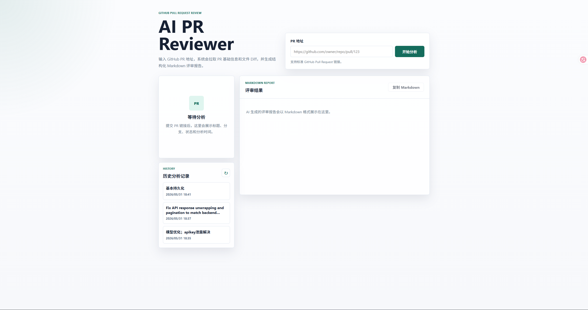
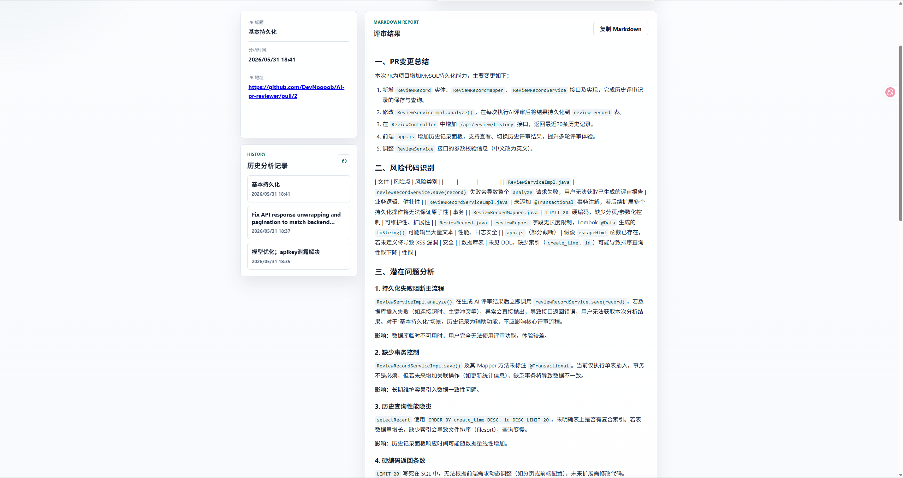
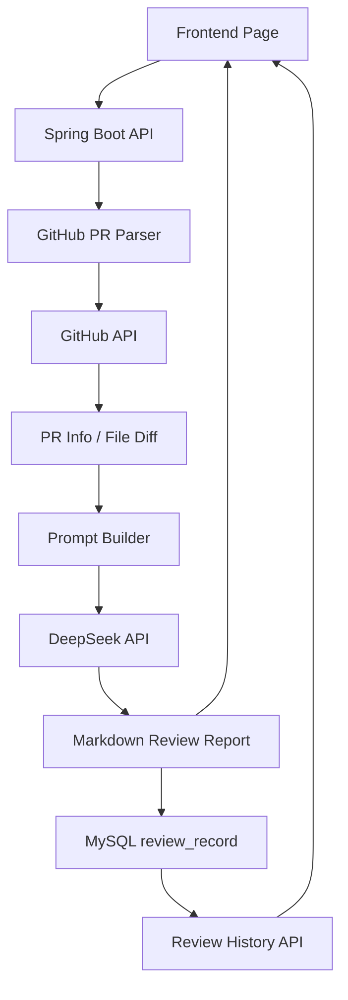

# AI PR Reviewer

一个基于 GitHub Pull Request Diff 和大语言模型的 AI 代码评审助手。

AI PR Reviewer 可以自动解析 GitHub PR 链接，获取 PR 基本信息与文件 Diff，构造代码评审 Prompt，调用 DeepSeek API 生成 Markdown 格式的 Review 报告，并将历史 Review 记录持久化保存到数据库中。


项目已部署在阿里云平台，访问地址：http://139.196.188.19:8080/

由于我的服务器性能较差，所以可能出现502报错，但是数据进入了数据库，可以历史记录中看到，实际部署不会出错。

视频演示：https://pan.baidu.com/s/1g7uIwTZvannBJZvVF9IElg?pwd=1234


本项目的灵感来源于当前快速发展的 AI 编程助手生态，例如 [OpenAI Codex](https://openai.com/index/introducing-codex/?utm_source=chatgpt.com)、[GitHub Copilot](https://github.com/features/copilot?utm_source=chatgpt.com) 等工具已经能够辅助开发者自动生成代码，甚至直接向 GitHub 仓库提交 Pull Request。

基于这一趋势，本项目进一步思考：如果 AI 不仅能够“编写代码”，还能“审查代码”，是否能够形成一个完整的自动化开发闭环？

因此，本项目设计了一种 AI 协同开发模式：

1. AI 编程助手（如 Codex）自动完成代码生成并提交 Pull Request；
2. AI PR Reviewer 自动获取 PR Diff，并基于大语言模型进行代码评审；
3. 系统生成风险分析、潜在 Bug 检测与优化建议；
4. AI 编程助手再次读取评审结果，对代码进行迭代修复；
5. 最终形成“生成 → 审查 → 修复 → 再审查”的自动化循环。

这种模式使 AI 不再只是单纯的代码生成工具，而是逐渐演变为具备“自我反馈”与“自我优化”能力的智能开发系统。

未来，结合 GitHub Webhook、CI/CD Pipeline、多模型协同（Coding Agent + Review Agent）以及静态代码分析技术，有可能进一步实现更加自动化、智能化的软件工程流程，构建真正意义上的 AI Autonomous Development Workflow（AI 自主开发工作流）。


## Screenshots

### 首页



### AI Review 结果



## Features

- GitHub PR URL 自动解析
- 自动获取 Pull Request 基本信息
- 自动获取 Pull Request 文件 Diff
- 基于大语言模型的 AI 智能代码评审
- 风险代码与潜在问题识别
- Markdown 格式 Review 报告生成
- 前端 Markdown 报告展示
- Review 历史记录持久化
- 最近 Review 历史记录查询
- Docker 容器化部署

## Tech Stack

### Backend

- Java 17
- Spring Boot 3.2.5
- Spring Web
- Spring Validation
- Spring Cloud OpenFeign
- MyBatis
- MySQL
- Lombok
- Jackson
- OkHttp

### AI

- DeepSeek API
- Prompt Engineering
- Git Diff 上下文构造
- Prompt 长度裁剪
- 单文件 Diff 截断

### Frontend

- HTML
- CSS
- JavaScript
- Fetch API
- Markdown Rendering

> 当前前端为 Spring Boot 静态资源页面，未引入 Vue3。后续可以平滑升级为 Vue3 独立前端。

### DevOps

- Docker
- Maven

## Architecture



## Workflow

1. 用户输入 GitHub Pull Request URL。
2. 系统解析 `owner`、`repo`、`pullNumber`。
3. 通过 GitHub API 获取 PR 基本信息。
4. 通过 GitHub API 获取 PR 文件 Diff。
5. 根据 PR 信息和 Diff 构造 AI Review Prompt。
6. 对超长 Diff 和 Prompt 进行裁剪，控制模型输入长度。
7. 调用 DeepSeek API 生成 Markdown 格式 Review 报告。
8. 将 PR URL、PR 标题、Review 报告和创建时间保存到 MySQL。
9. 将 Review 结果返回给前端展示。
10. 前端可通过历史记录查看最近的 Review 报告。

## Docker Deploy

### Prerequisites

部署前需要准备：

- Java 17
- Maven
- Docker
- MySQL
- GitHub Access Token
- DeepSeek API Key

数据库需要提前创建：

```sql
CREATE DATABASE ai_pr_reviewer
    DEFAULT CHARACTER SET utf8mb4
    DEFAULT COLLATE utf8mb4_unicode_ci;
```

然后执行项目中的 `src/main/resources/schema.sql` 初始化 `review_record` 表。

### Build

```bash
mvn clean package -DskipTests
docker build -t ai-pr-reviewer .
```

### Run

```bash
docker run -d \
  --name ai-pr-reviewer \
  -p 8080:8080 \
  -e MYSQL_HOST=host.docker.internal \
  -e MYSQL_PASSWORD=your_mysql_password \
  -e GITHUB_TOKEN=your_github_token \
  -e DEEPSEEK_API_KEY=your_deepseek_api_key \
  ai-pr-reviewer
```

启动后访问：

```text
http://localhost:8080
```

如果 MySQL 也运行在 Docker 网络中，可以将 `MYSQL_HOST` 改为对应的 MySQL 容器名或服务名。

## Environment Variables

| Name | Description | Required |
|------|-------------|----------|
| `MYSQL_HOST` | MySQL 主机地址，默认 `localhost` | No |
| `MYSQL_PASSWORD` | MySQL `root` 用户密码 | Yes |
| `GITHUB_TOKEN` | GitHub Access Token，用于调用 GitHub API | Yes |
| `DEEPSEEK_API_KEY` | DeepSeek API Key，用于生成 AI Review | Yes |

## API Examples

### Analyze Pull Request

```http
POST /api/review/analyze
Content-Type: application/json
```

请求示例：

```json
{
  "prUrl": "https://github.com/xxx/xxx/pull/1"
}
```

响应示例：

```json
{
  "code": 200,
  "message": "成功",
  "data": {
    "prTitle": "Add user login feature",
    "prState": "open",
    "headRef": "feature/login",
    "baseRef": "main",
    "prUrl": "https://github.com/xxx/xxx/pull/1",
    "reviewReport": "## 一、PR 变更总结\n...",
    "analyzeTime": "2026-05-31T18:30:00"
  }
}
```

### Review History

```http
GET /api/review/history
```

响应示例：

```json
{
  "code": 200,
  "message": "成功",
  "data": [
    {
      "id": 1,
      "prUrl": "https://github.com/xxx/xxx/pull/1",
      "prTitle": "Add user login feature",
      "reviewReport": "## 一、PR 变更总结\n...",
      "createTime": "2026-05-31T18:30:00"
    }
  ]
}
```

## Highlights

- 本次项目的每次PR都通过自己的功能Review过
- 基于 GitHub PR Diff 的 AI Code Review，而不是只分析提交说明。
- 通过 OpenFeign 对接 GitHub API，自动获取 PR 元信息与文件变更。
- 针对 `.java`、`.kt`、`.py`、`.js`、`.ts`、`.vue` 等代码文件进行重点分析。
- 内置 Prompt 上下文裁剪策略，避免超长 Diff 导致模型输入过大。
- 单文件 Diff 截断优化，兼顾 Review 覆盖面和响应速度。
- DeepSeek API 调用使用 OkHttp，并配置较长读取超时以适配 AI 响应耗时。
- AI Review 报告以 Markdown 格式输出，前端进行结构化渲染。
- Review 历史记录落库保存，让项目具备完整的数据闭环。
- 前后端集成在一个 Spring Boot 应用中，部署简单。
- Docker 容器化运行，便于部署到服务器或云平台。

## Future Plans

- 多模型支持：OpenAI、Claude、Qwen、DeepSeek 等 Provider 可配置切换。
- 引入 AST 静态分析，提高代码结构级别的问题识别能力。
- 增加 Review Risk Score，对 PR 风险进行量化评分。
- 支持 GitHub Webhook，在 PR 创建或更新时自动触发分析。
- 支持将 AI Review 评论自动回写到 GitHub PR。
- 增加多人协作 Review 与 Review 状态管理。
- 支持更完整的 Markdown 渲染能力和代码高亮。
- 将前端升级为 Vue3，实现更丰富的交互体验。
